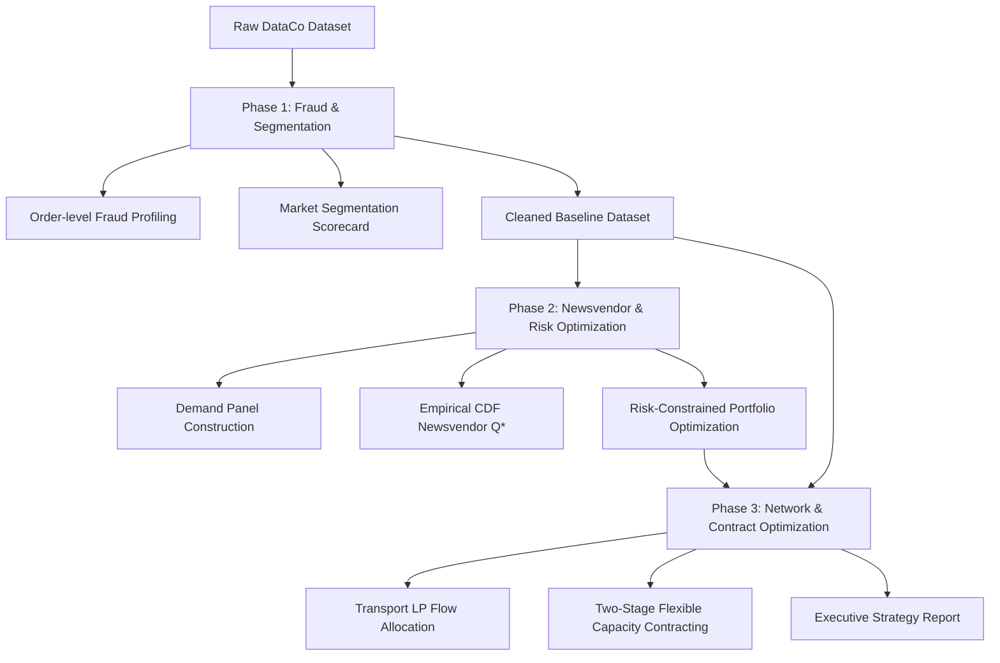

# 🔗 DataCo Smart Supply Chain — Operations Analytics Capstone

[](https://www.python.org/)
[](https://jupyter.org/)
[](https://coin-or.github.io/pulp/)
[](https://www.kaggle.com/datasets/shashwatwork/dataco-smart-supply-chain-for-big-data-analysis)

---

## 📝 Project Overview

This repository hosts a comprehensive **Operations Analytics & Supply Chain Optimization Capstone** focused on the global logistics, inventory, and transaction operations of **DataCo Global**. The project implements a rigorous 3-phase quantitative framework that transitions from diagnostic data cleansing and risk profiling, to predictive demand modeling, and finally to prescriptive optimization of inventory portfolios, transportation networks, and capacity contracting.

The workflow is designed to bridge the gap between technical data science and corporate decision-making, ensuring that every mathematical recommendation directly addresses bottom-line financial performance and risk management.

---

## 🎯 Business Objectives

1. **Establish a Clean Demand Baseline**: Diagnose raw transactional data to isolate fraudulent and canceled transactions, eliminating artificial demand inflation and ensuring optimization models are built on genuine historical demand.
2. **Optimize Stochastic Inventory Decisions**: Formulate and solve the multi-product Newsvendor problem under uncertain demand, balancing the financial trade-offs between inventory excess (overage cost) and stockouts (underage cost).
3. **Control Financial Portfolio Risk**: Deploy constrained optimization techniques to balance the expected monthly profit of the inventory portfolio against cash flow volatility (StdDev) and downside risk constraints.
4. **Minimize Logistical Network Costs**: Develop a linear programming (LP) transportation model to optimize the distribution of goods from source markets to consumption regions, accounting for transit times, late delivery penalties, and margin pressures.
5. **Evaluate Strategic Capacity Contracts**: Determine the financial viability of a two-stage flexible logistics capacity agreement under market demand uncertainty, comparing the value of contract flexibility against spot market procurement.

---

## ⚙️ Analytical Workflow

The project is structured into three sequential phases, each building upon the output of the prior stage:



### Phase 1: Fraud Order Analysis & Market Segmentation
*   **Data Cleansing**: Load the raw transactional dataset (using Latin-1 encoding) and parse dates. Drop PII and high-null columns.
*   **Fraud Profiling**: Group by order identifiers to prevent item-level duplication. Analyze fraud rates across payment types, customer segments, and geographical markets to establish a baseline fraud filter.
*   **Segmentation**: Build a multi-dimensional scorecard (Revenue, Order Count, Profit Margin, Late Delivery Rate, Average Discount) for every Market × Segment combination, classifying them into strategic risk-reward tiers.

### Phase 2: Newsvendor Model & Risk-Constrained Optimization
*   **Demand Panel Construction**: Construct a monthly demand panel at the `Category Name × Month` grain, validating against demand censoring indicators (pending and canceled rates).
*   **Stochastic Newsvendor Model**: Formulate the underage ($c_u$) and overage ($c_o$) costs for each product category using weighted historical prices, margins, and discounts. Fit empirical distributions to compute the optimal safety stock level ($Q^*$).
*   **Constrained Portfolio Optimization**: Maximize expected total profit across all categories using Differential Evolution, subject to a global capital budget, category-level service levels (SLA $\ge 80\%$), and varying risk budgets (Strict, Base, Relaxed).

### Phase 3: Transportation Network LP & Two-Stage Capacity Contract
*   **Transportation LP**: Formulate a cost minimization linear program (LP) mapping 5 supplier markets to 23 consumer regions. Construct the cost matrix ($cost_{ij}$) incorporating average shipping times, late delivery risk penalties, and discount pressures. Solve using PuLP to identify optimal flows and binding bottlenecks.
*   **Two-Stage Flexible capacity Contract**: Formulate a two-stage decision model under demand uncertainty (Strong vs. Weak demand signals). Optimize Stage 1 capacity commitment ($Q_1$) and Stage 2 top-up capacity rules ($Q_{2,s}$) by evaluating the Expected Value of Flexibility (EVF).

---

## 📊 Key Metrics

*   **Total Clean Transactions**: 172,765 items (representing 65,752 unique orders)
*   **Clean Baseline Revenue**: $35.21M
*   **Base Fraud Rate**: 2.26% (exclusively tied to `TRANSFER` payments, which exhibit a 8.23% fraud rate)
*   **Optimized Monthly Inventory Profit**: $84,506.72 (Strict 10% Risk Policy)
*   **Freed Working Capital**: $39,073.46 per month (a 4.83% decrease in purchasing costs with minimal profit compromise)
*   **Minimum Logistical Network Cost**: $420,270.28 per month to fulfill global demand
*   **High-Volume Lanes**: LATAM $\rightarrow$ Central America (1,609.2 units) and Europe $\rightarrow$ Western Europe (1,457.9 units)

---

## 💡 Main Findings

### 1. Fraud Risk Profile
*   **Payment Method Anomaly**: Fraud is exclusively concentrated in transactions using the **TRANSFER** payment method (representing an **8.23% fraud rate**). All other payment methods (CASH, DEBIT, PAYMENT) exhibit **0.00% fraud**.
*   **Highest Risk Segment**: Individual customers in the USCA market paying via transfer (**USCA × TRANSFER × Consumer**) represent the highest risk combination, with a **9.31% fraud rate**.
*   **Operational Directive**: Exclude all `CANCELED` and `SUSPECTED_FRAUD` transactions from the baseline demand data to avoid demand inflation.

### 2. Market Segmentation (Pareto Principle)
*   **Revenue Concentration**: The top three markets—**Europe (29.5%)**, **LATAM (27.9%)**, and **Pacific Asia (22.6%)**—account for **80% of total revenue**, confirming a classic Pareto distribution.
*   **High-Value Champion**: **Pacific Asia × Consumer** is the best performing segment, yielding $4.10M in revenue with the highest profit margin of **4.7%**.
*   **High-Risk Warning**: **USCA × Corporate** exhibits thin profit margins (**2.7%**) combined with high delivery delays (**58.0% late rate**).

### 3. Inventory Optimization Insights
*   **Defensive Procurement Policy**: The Critical Ratio ($CR$) for the majority of categories is low (**0.13 - 0.17**). Because the overage cost (procurement cost minus salvage value, $c_o = c - s$) is approximately 6 times larger than the underage cost (opportunity profit, $c_u = p - c$), the optimal procurement quantity $Q^*$ is defensively set below the historical mean demand ($Q^* < \mu$).
*   **Risk-Reward Frontier**: Implementing a **Strict (10%) Risk Policy** reduces portfolio volatility (StdDev) by **6.74%** while sacrificing only **2.04%** of expected profit. This policy reduces purchasing costs from $809K to $770K, freeing up **$39,073.46** in cash flow every month.

### 4. Logistics & Contracting Decisions
*   **Network Bottlenecks**: The Transportation LP indicates that all 5 supply markets operate at **100% capacity utilization (binding constraints)**, highlighting a highly congested logistics network with zero safety capacity.
*   **Contract Feasibility**: The two-stage flexible contract model recommends **not signing the agreement ($Q_1^* = 0$, $Q_2^* = 0$)**. Because the marginal cost ($MC$) of contract capacity ($33.84 fixed, $43.99 flexible) exceeds the marginal revenue contribution ($MR = $28.74 per unit), procurement is more economical on the spot market.

---

## 📦 Outputs

The analytical execution produces the following structured output artifacts:

### Phase 1 Outputs (Location: `Output/Phase1/`)
*   `fraud_profile_order_level.csv`: Order-level fraud ratios grouped by payment type, market, and customer segment.
*   `market_segment_scorecard.csv`: Revenue, profit, margin, and delivery performance metrics for all market segments.
*   `operations_guide_phase1.html`: Analytical walkthrough and narrative explaining data cleaning and profiling.
*   `figures/`: Strategic charts, including:
    *   `p1_fraud_heatmap_market_type.png`: Heatmap of fraud rate by market and payment type.
    *   `p2_heatmap_profit_margin_late_delivery.png`: Risk-reward mapping of market segments.
    *   `p2_pareto_revenue_market.png`: Pareto curve of market revenues.

### Phase 2 Outputs (Location: `Output/Phase2/`)
*   `demand_panel_category_month.csv`: Cleaned historical demand panel grouped by category and month.
*   `category_demand_stats.csv`: Mean, standard deviation, and percentiles of demand by product category.
*   `newsvendor_results.csv`: Cost metrics, Critical Ratios, optimal quantities ($Q^*$), expected profits, and loss probabilities.
*   `risk_frontier.csv`: Performance metrics (expected profit, StdDev, capital cost) across Strict, Base, and Relaxed risk budgets.
*   `figures/`:
    *   `p3_demand_distribution_top6.png`: Distribution fits for top product categories.
    *   `p4_qstar_vs_demand.png`: Visualization of optimal Q* relative to demand mean.
    *   `p5_risk_reward_frontier.png`: Volatility vs. expected profit frontier curve.

### Phase 3 Outputs (Location: `Output/Phase3/`)
*   `transport_cost_matrix.csv`: Formulated shipping cost matrix mapping markets to regions.
*   `optimal_transport_flows.csv`: Minimum-cost distribution volumes ($x_{ij}$) along optimized lanes.
*   `contract_scenarios.csv`: Simulated profits, demand uplifts, and delivery rates across 1,000 Monte Carlo runs.
*   `contract_policy.csv`: Optimal values for fixed commitment ($Q_1^*$) and flexible top-up rules ($Q_2^*$).
*   `strategy_comparison.csv`: Strategic comparison (Expected Profit, Volatility, Downside VaR) of spot vs. fixed vs. flexible contracts.
*   `figures/`:
    *   `p6_optimal_flows_heatmap.png`: Heatmap of LP flow allocations.
    *   `p6_sensitivity_analysis.png`: Logistics cost sensitivity to delay penalties and capacity shifts.
    *   `p7_strategy_bar_comparison.png`: Visual comparison of contract performance.

### Executive Report (Location: `Output/`)
*   `executive_report.html`: A high-end, responsive HTML executive dashboard presenting interactive tabs, KPI cards, and visual figures for C-level presentation.

---

## 🛠️ Setup and Usage

### Prerequisites
Make sure you have Python 3.8+ installed on your system.

### 1. Repository Installation
Clone this repository to your local machine:
```bash
git clone https://github.com/huytk16/DataCo-SMART-SUPPLY-CHAIN-FOR-BIG-DATA-ANALYSIS.git
cd DataCo-SMART-SUPPLY-CHAIN-FOR-BIG-DATA-ANALYSIS
```

### 2. Environment Setup & Dependencies
Create a virtual environment and install the required scientific and optimization libraries:
```bash
# Create virtual environment
python -m venv venv

# Activate virtual environment (Windows)
.\venv\Scripts\activate

# Activate virtual environment (macOS/Linux)
source venv/bin/activate

# Install required packages
pip install -r requirements.txt
```

*Note: The dependencies include `pandas`, `numpy`, `scipy`, `pulp`, `matplotlib`, `seaborn`, and `jupyter`.*

### 3. Placing the Dataset
Download the raw dataset files from Kaggle and place them in the `Data/` directory:
👉 **[DataCo SMART SUPPLY CHAIN FOR BIG DATA ANALYSIS on Kaggle](https://www.kaggle.com/datasets/shashwatwork/dataco-smart-supply-chain-for-big-data-analysis)**

Confirm that the `Data/` folder contains the following structure:
```
Data/
├── DescriptionDataCoSupplyChain.csv     # (Already included in repository)
├── DataCoSupplyChainDataset.csv       # (Download from Kaggle)
└── tokenized_access_logs.csv          # (Download from Kaggle, optional)
```

### 4. Running the Jupyter Notebooks
Run the Jupyter Notebook server:
```bash
jupyter notebook
```
Open and execute the notebooks in the `Notebooks/` directory in the following sequential order:
1. **`Notebooks/Phase1_DataQuality_Fraud_Segmentation.ipynb`**: Performs data validation, fraud profiling, and market segmentation, exporting cleaned files to `Output/Phase1/`.
2. **`Notebooks/Phase2_Newsvendor_Risk_Optimization.ipynb`**: Formulates Newsvendor models and runs the Differential Evolution algorithm to build the risk-reward frontier, exporting to `Output/Phase2/`.
3. **`Notebooks/Phase3_Network_Contract_Optimization.ipynb`**: Solves the network flow LP and runs Monte Carlo contract simulation, exporting to `Output/Phase3/` and updating the `executive_report.html`.

---

## 📄 References & Citation
*   **Dataset Source**: Constante, Fabian; Silva, Fernando; Pereira, António (2019), "DataCo SMART SUPPLY CHAIN FOR BIG DATA ANALYSIS", Mendeley Data, V5, doi: 10.17632/8gx2fvg2k6.5.
*   **Academic Framework**: Concepts adapted from the *Operations Analytics* curriculum of the Wharton School, University of Pennsylvania.
