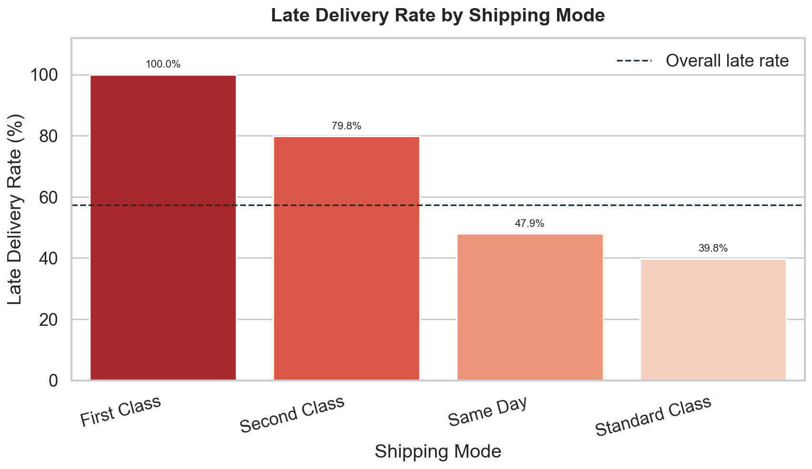
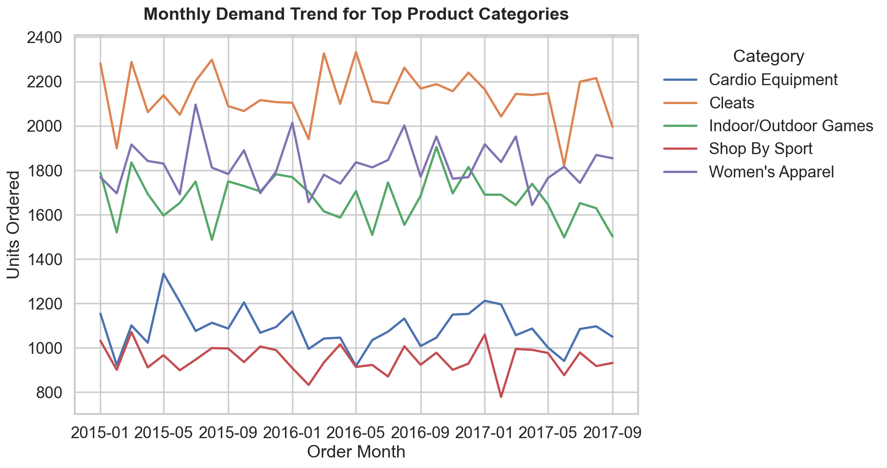
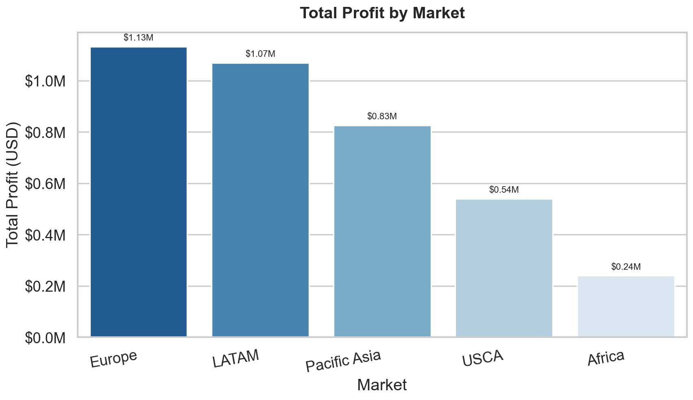
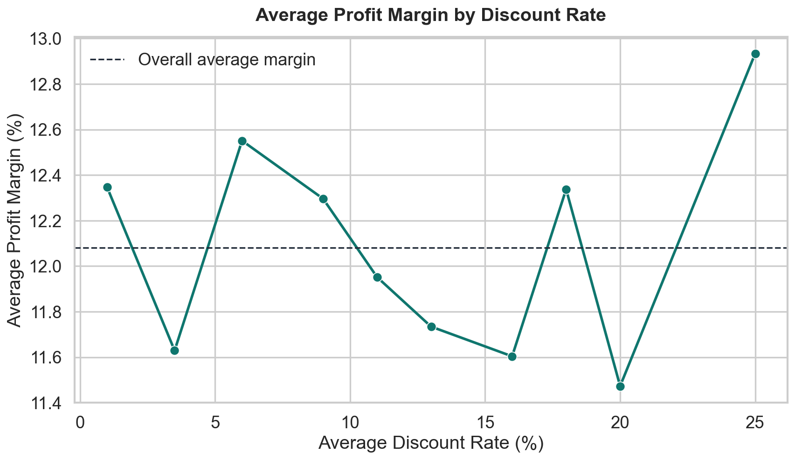

# DataCo Smart Supply Chain Analytics

## Project Overview

This project analyzes the DataCo Smart Supply Chain dataset to identify operational bottlenecks, demand patterns, inventory risks, and profit optimization opportunities across a global retail supply chain.

The analysis is organized into three analytical tracks:

- Logistics performance and late delivery risk
- Demand forecasting and inventory optimization
- Profitability and discount strategy optimization

The final project structure is designed for GitHub publication, with raw datasets, notebooks, visual outputs, and reports separated into clear folders.

## Business Problem

DataCo operates across multiple markets, customer segments, product categories, and shipping modes. The business faces three major operational questions:

- Why are many orders delivered late, and which shipping modes or regions create the highest risk?
- Which product categories drive the largest demand, and how should inventory decisions respond to demand variability?
- How do discount strategies affect profit margin, and where should the business focus to improve profitability?

The goal of this project is to convert raw supply chain data into practical recommendations for logistics improvement, inventory planning, and pricing strategy.

## Dataset

Dataset source: [DataCo SMART SUPPLY CHAIN FOR BIG DATA ANALYSIS on Kaggle](https://www.kaggle.com/datasets/shashwatwork/dataco-smart-supply-chain-for-big-data-analysis).

The main dataset is expected at `Data/DataCoSupplyChainDataset.csv` after download.

Dataset summary:

- Raw records: 180,519 rows
- Columns: 53
- Clean analysis records: 172,765 rows after removing `CANCELED` and `SUSPECTED_FRAUD` orders
- Date range after cleaning: 2015-01-01 to 2018-01-31
- Markets: Africa, Europe, LATAM, Pacific Asia, USCA
- Customer segments: Consumer, Corporate, Home Office

Dataset files:

- `Data/DataCoSupplyChainDataset.csv`: main order, customer, product, logistics, sales, and profit dataset
- `Data/DescriptionDataCoSupplyChain.csv`: field descriptions for the main dataset
- `Data/tokenized_access_logs.csv`: tokenized access log file included with the original dataset package

Important note: the `Data/` folder is excluded from the GitHub repository. Download the dataset from Kaggle and place the files in `Data/` locally before running the notebooks.

## Tools & Libraries

Core tools:

- Python
- Jupyter Notebook / Google Colab
- pandas
- numpy
- matplotlib
- seaborn
- scipy
- statsmodels
- scikit-learn

Analytical methods:

- Exploratory data analysis
- Time-series aggregation
- Seasonal decomposition
- Moving average forecasting
- Linear regression
- Polynomial regression
- Newsvendor inventory optimization
- Monte Carlo simulation
- Linear programming
- Non-linear optimization
- Chi-Square statistical testing

## Project Structure

```text
.
|-- Data/
|   |-- DataCoSupplyChainDataset.csv
|   |-- DescriptionDataCoSupplyChain.csv
|   `-- tokenized_access_logs.csv
|-- Notebook/
|   |-- logistics_late_delivery_analysis.ipynb
|   |-- demand_forecasting_inventory.ipynb
|   `-- profit_discount_optimization.ipynb
|-- Outputs/
|   |-- charts/
|   |   |-- chart_index.md
|   |   |-- chart_manifest.csv
|   |   |-- demand_forecasting_inventory/
|   |   |   `-- 13 extracted report charts
|   |   |-- logistics_late_delivery_analysis/
|   |   |   `-- 6 extracted report charts
|   |   |-- profit_discount_optimization/
|   |   |   `-- 10 extracted report charts
|   |   |-- late_delivery_by_shipping_mode.png
|   |   |-- monthly_demand_top_categories.png
|   |   |-- total_profit_by_market.png
|   |   `-- discount_vs_profit_margin.png
|   `-- reports/
|       |-- logistics_late_delivery_analysis.html
|       |-- demand_forecasting_inventory.html
|       `-- profit_discount_optimization.html
|-- References/
|   |-- Optimization_Toolkit_Review_Notebook.pdf
|   |-- tong_hop_kien_thuc_operations_analytics.pdf
|   |-- Tong_hop_Kien_thuc_Simulation_Excel.pdf
|   `-- Tong_hop_Kien_thuc_Tuan4_Decision_Analytics.pdf
`-- README.md
```

## References

The `References/` folder contains supporting learning materials and methodology notes used as background references for the analysis:

- `References/Optimization_Toolkit_Review_Notebook.pdf`
- `References/tong_hop_kien_thuc_operations_analytics.pdf`
- `References/Tong_hop_Kien_thuc_Simulation_Excel.pdf`
- `References/Tong_hop_Kien_thuc_Tuan4_Decision_Analytics.pdf`

## Data Cleaning & Preparation

The notebooks apply the following preparation steps:

- Load the main CSV with `ISO-8859-1` compatible encoding.
- Remove orders with `Order Status` equal to `CANCELED` or `SUSPECTED_FRAUD`.
- Parse order and shipping date columns into datetime fields.
- Create time-based fields such as order month and day of week.
- Create logistics features:
  - `Shipping_Delay_Days`
  - `Is_Late`
- Create profitability features:
  - `Profit_Margin`
  - `Discount_Rate`
- Aggregate demand by product category, product name, and month.

## Exploratory Data Analysis

### Logistics Late Delivery Analysis

Notebook: `Notebook/logistics_late_delivery_analysis.ipynb`

This analysis measures delivery performance and identifies operational bottlenecks by shipping mode, market, order region, product category, and time period.

Main metrics:

- Late Delivery Rate: 57.29%
- Average actual shipping time: 3.50 days
- Average delay among late orders: 1.62 days

The notebook also compares financial performance between late and non-late orders and applies Chi-Square tests to validate whether shipping mode and order region are statistically associated with late delivery.

### Demand Forecasting & Inventory Optimization

Notebook: `Notebook/demand_forecasting_inventory.ipynb`

This analysis identifies top-demand product categories and products, decomposes monthly demand into trend and seasonality, and applies forecasting methods for inventory planning.

Methods used:

- Monthly demand aggregation
- Seasonal decomposition
- 3-month moving average forecast
- Linear regression forecast
- Newsvendor Model for optimal order quantity
- Monte Carlo simulation with 10,000 runs to validate inventory decisions

Top categories by ordered quantity:

- Cleats: 70,611 units
- Women's Apparel: 60,232 units
- Indoor/Outdoor Games: 55,333 units
- Cardio Equipment: 35,937 units
- Shop By Sport: 31,329 units

### Profit & Discount Optimization

Notebook: `Notebook/profit_discount_optimization.ipynb`

This analysis evaluates profitability by customer segment and market, then models the relationship between discount rate and profit margin.

Methods used:

- Segment-level profit analysis
- Market-level profit analysis
- Polynomial regression for discount impact
- Linear programming for constrained discount optimization
- Grid search and non-linear optimization for net profit maximization

Profit by customer segment:

- Consumer: $1.98M total profit, 12.13% average margin
- Corporate: $1.16M total profit, 12.08% average margin
- Home Office: $0.67M total profit, 11.95% average margin

## Key Insights

- Late delivery is the largest operational risk. More than half of cleaned orders were delivered late.
- First Class shipping shows the highest late delivery rate in this dataset, reaching 100.0%.
- Second Class shipping also performs poorly, with a 79.8% late delivery rate.
- Standard Class has the lowest late delivery rate among the available shipping modes, at 39.8%.
- Demand is concentrated in a small group of categories, especially Cleats, Women's Apparel, and Indoor/Outdoor Games.
- Europe and LATAM generate the highest total profit among markets.
- Consumer is the most profitable customer segment by total profit.
- Average profit margin is similar across segments, which suggests that profit differences are mainly driven by order volume rather than margin alone.
- Discount decisions should be optimized by segment and market instead of applying a single discount policy across the business.

## Visualizations

All charts from the exported analysis reports are stored in `Outputs/charts/`:

- Full chart index: `Outputs/charts/chart_index.md`
- Machine-readable manifest: `Outputs/charts/chart_manifest.csv`
- Demand forecasting & inventory charts: `Outputs/charts/demand_forecasting_inventory/` with 13 charts
- Logistics late delivery charts: `Outputs/charts/logistics_late_delivery_analysis/` with 6 charts
- Profit & discount optimization charts: `Outputs/charts/profit_discount_optimization/` with 10 charts

The README below highlights a smaller set of key visuals for quick project review.

### Late Delivery Rate by Shipping Mode



This chart shows that First Class and Second Class shipping carry the highest late delivery risk.

### Monthly Demand Trend for Top Categories



This chart highlights the demand concentration and monthly variation across the highest-volume product categories. The chart uses the stable top-category period through 2017-09 to avoid distortion from sparse category data at the end of the dataset.

### Total Profit by Market



Europe and LATAM are the strongest markets by total profit, while Africa contributes the smallest total profit in this dataset.

### Average Profit Margin by Discount Rate



This chart summarizes how average margin changes across discount bands and supports the need for controlled discount optimization.

## Business Recommendations

1. Prioritize logistics improvement for First Class and Second Class shipping.
   - These shipping modes have the highest late delivery rates and should be reviewed for capacity, carrier reliability, SLA design, and fulfillment process gaps.

2. Monitor late delivery by region and shipping mode together.
   - Shipping mode alone is not enough. The Chi-Square tests indicate that both shipping mode and order region are statistically related to late delivery risk.

3. Build inventory policies around the highest-demand categories.
   - Cleats, Women's Apparel, and Indoor/Outdoor Games should receive dedicated forecasting, reorder point monitoring, and stockout tracking.

4. Use seasonal demand adjustments.
   - Inventory quantities should be increased during high-season months and reduced during low-season months based on seasonal indices.

5. Apply the Newsvendor Model for replenishment decisions.
   - The model helps balance underage cost from stockouts and overage cost from excess inventory.

6. Treat discounting as an optimization problem, not only a sales tactic.
   - Discounts should be evaluated by their effect on net profit, not only revenue or order volume.

7. Focus commercial resources on high-profit markets and segments.
   - Europe, LATAM, and the Consumer segment deserve priority for retention, marketing investment, and service quality.

## How to Run This Project

1. Clone this repository.

2. Install the required Python libraries:

```bash
pip install pandas numpy matplotlib seaborn scipy statsmodels scikit-learn jupyter
```

3. Open Jupyter Notebook:

```bash
jupyter notebook
```

4. Run the notebooks in this order:

- `Notebook/logistics_late_delivery_analysis.ipynb`
- `Notebook/demand_forecasting_inventory.ipynb`
- `Notebook/profit_discount_optimization.ipynb`

5. If running locally, update the data loading path inside each notebook to:

```python
data_path = "../Data/DataCoSupplyChainDataset.csv"
```

The notebooks were originally developed in Google Colab, so some cells still reference Google Drive paths.

6. Open the exported HTML reports in:

- `Outputs/reports/logistics_late_delivery_analysis.html`
- `Outputs/reports/demand_forecasting_inventory.html`
- `Outputs/reports/profit_discount_optimization.html`

## Results / Final Conclusion

The DataCo supply chain analysis shows that operational performance, inventory planning, and pricing strategy are tightly connected.

The most urgent issue is logistics reliability. A 57.29% late delivery rate indicates that delivery performance is a major business risk, especially for premium shipping modes that customers likely expect to be faster and more reliable.

From the demand and inventory perspective, sales volume is concentrated in a limited number of categories. This makes targeted forecasting and inventory optimization more valuable than a generic policy across all products.

From the profitability perspective, Europe, LATAM, and the Consumer segment are the strongest profit contributors. Discounting should be controlled with segment-level optimization because margin behavior varies across discount bands and customer groups.

Overall, the business should prioritize logistics SLA improvement, category-level inventory planning, and disciplined discount optimization to improve service quality and profitability.
