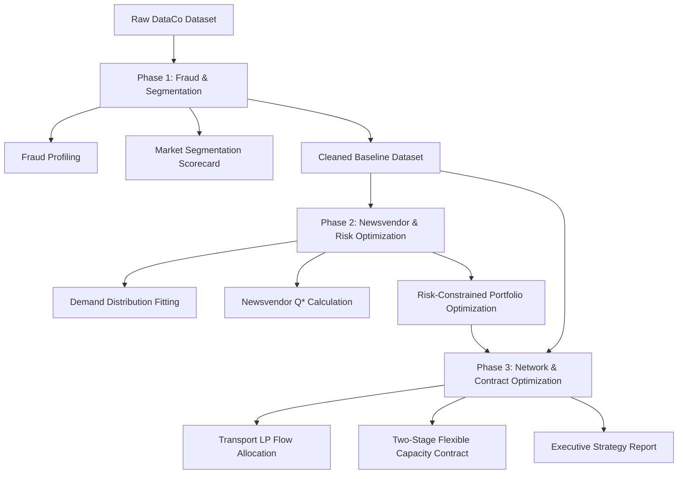

# 🔗 DataCo Smart Supply Chain — Operations Analytics Capstone

[](https://www.python.org/)
[](https://jupyter.org/)
[](https://coin-or.github.io/pulp/)
[](https://www.kaggle.com/datasets/shashwatwork/dataco-smart-supply-chain-for-big-data-analysis)

This repository contains an end-to-end **Operations Analytics & Supply Chain Optimization** project on the global supply chain operations of DataCo Global. The analysis is structured into a logical 3-phase framework spanning risk profiling, inventory decision-making, network design, and capacity contracting.

---

## 📌 Project Architecture

The analytics workflow progresses systematically from diagnostic analysis to predictive modeling and prescriptive optimization:



---

## 📂 Repository Structure

```
├── Data/
│   ├── DescriptionDataCoSupplyChain.csv     # Metadata and column definitions
│   └── (DataCoSupplyChainDataset.csv)       # Excluded from Git (download from Kaggle)
│   └── (tokenized_access_logs.csv)          # Excluded from Git (download from Kaggle)
├── Notebooks/
│   ├── Phase1_DataQuality_Fraud_Segmentation.ipynb  # Setup, Fraud, and Market Segmentation
│   ├── Phase2_Newsvendor_Risk_Optimization.ipynb     # Demand construction, Newsvendor, and Risk budgets
│   └── Phase3_Network_Contract_Optimization.ipynb    # Transport LP and Two-Stage Flexible Contracting
├── Output/
│   ├── Phase1/
│   │   ├── figures/                         # Phase 1 plots (heatmaps, Pareto charts)
│   │   ├── fraud_profile_order_level.csv    # Fraud rates by transaction types
│   │   ├── market_segment_scorecard.csv    # Market performance metrics
│   │   └── operations_guide_phase1.html     # HTML Walkthrough of Phase 1
│   ├── Phase2/
│   │   ├── figures/                         # Phase 2 plots (demand fitting, frontier)
│   │   ├── category_demand_stats.csv        # Summary demand parameters by category
│   │   ├── demand_panel_category_month.csv  # Monthly demand panel
│   │   ├── newsvendor_results.csv           # Optimal Q* and profit distribution per category
│   │   ├── risk_frontier.csv                # Risk-reward trade-offs
│   │   └── Phase2_Business_Technical_Review_Report.html
│   ├── Phase3/
│   │   ├── figures/                         # Phase 3 plots (flows, sensitivity)
│   │   ├── transport_cost_matrix.csv        # Formulated cost matrix between markets and regions
│   │   ├── optimal_transport_flows.csv      # Transport LP optimization results
│   │   ├── contract_scenarios.csv           # Simulation results for flexible capacity
│   │   ├── contract_policy.csv              # Optimal Q1, Q2 rules
│   │   ├── strategy_comparison.csv          # Fixed vs Flexible vs Baseline comparison
│   │   └── operations_guide_phase3.html
│   └── executive_report.html                # Compiled C-level presentation report
├── References/
│   └── *.pdf                                # Operational literature and analytics notes
└── .gitignore                               # Specifies excluded files (Data, temp, etc.)
```

---

## 📊 Dataset & Setup

### 1. Download Dataset
The main supply chain dataset contains **180,519 transactions** with **53 features** (item-level granularity). Due to file sizes (~95MB each), the raw CSVs are ignored in this repository. 
To run the notebooks, please download the files from Kaggle and place them in the `Data/` directory:
👉 **[DataCo SMART SUPPLY CHAIN FOR BIG DATA ANALYSIS on Kaggle](https://www.kaggle.com/datasets/shashwatwork/dataco-smart-supply-chain-for-big-data-analysis)**

Expected files in `Data/`:
- `DataCoSupplyChainDataset.csv`
- `tokenized_access_logs.csv`
- `DescriptionDataCoSupplyChain.csv`

### 2. Data Quality & Warnings
*   **Encoding**: The dataset contains special characters and must be loaded using Latin-1 encoding:
    ```python
    df = pd.read_csv('Data/DataCoSupplyChainDataset.csv', encoding='latin-1')
    ```
*   **Item-Level Grain**: Each row represents a single product item in an order. Summing order-level columns (e.g., `Order Profit Per Order` or `Benefit per order`) directly will result in severe double-counting. Always deduplicate by `Order Id` before evaluating order-level performance.
*   **Suspected Fraud Filtering**: For Phase 1, `SUSPECTED_FRAUD` rows are preserved as the label. For Phase 2 (Newsvendor) and Phase 3 (Network), `SUSPECTED_FRAUD` and `CANCELED` orders are excluded to create an unbiased demand baseline.

---

## 🔍 Phase Walkthrough & Mathematical Modeling

### 1. Phase 1: Fraud Order Analysis & Market Segmentation
*   **Goal**: Profile transaction characteristics to isolate fraudulent patterns and segment the global market by risk-reward metrics.
*   **Key Techniques**:
    *   Crosstab lifting analysis across payment `Type`, customer `Market`, and `Customer Segment`.
    *   Calculation of order-level profit margins and late delivery rates.
*   **Results**: Identified payment channels with anomalous fraud rates (e.g., `TRANSFER` payment methods combined with specific markets). Categorized Market-Segment pairs into Risk Tiers (e.g., *Europe-Consumer* as a High-Value segment, and *Africa-Consumer* as a High-Risk segment).

### 2. Phase 2: Newsvendor Model & Risk-Constrained Optimization
*   **Goal**: Determine optimal monthly order quantities ($Q_k^*$) for each product category under stochastic demand, then balance the inventory portfolio subject to a global risk budget.
*   **Mathematical Model**:
    *   **Newsvendor Critical Ratio**:
        $$CR_k = \frac{p_k - c_k}{p_k - s_k}$$
        *Where:*
        *   $p_k$: Weighted average product selling price
        *   $c_k$: Unit procurement cost proxy (derived from historic profit margins)
        *   $s_k$: Salvage value proxy (derived from average discount rates)
    *   **Optimal Order Quantity**:
        $$Q_k^* = F_{D_k}^{-1}(CR_k)$$
        *Where $F_{D_k}^{-1}$ is the inverse CDF of the empirical demand distribution.*
    *   **Risk-Constrained Portfolio Formulation**:
        $$\max_{Q_k \ge 0} \mathbb{E}\left[\sum_{k} \text{Profit}_k(Q_k)\right]$$
        *Subject to:*
        $$\text{StdDev}\left(\sum_{k} \text{Profit}_k(Q_k)\right) \le \text{Risk Budget}$$
        $$P(D_k \le Q_k) \ge 80\% \quad \forall k \quad (\text{Service Level SLA})$$
        $$\sum_{k} c_k Q_k \le \text{Capital Budget}$$

### 3. Phase 3: Network Optimization & Two-Stage Capacity Contract
*   **Goal**: Optimize shipment routing from markets (supply sources) to destination regions, then evaluate a two-stage flexible capacity contract to mitigate logistics delays.
*   **Mathematical Model**:
    *   **Transportation LP**:
        $$\min_{x_{ij} \ge 0} \sum_{i} \sum_{j} \text{cost}_{ij} \cdot x_{ij}$$
        *Subject to:*
        $$\sum_{j} x_{ij} \le \text{supply}_i \quad \forall i \in \text{Markets}$$
        $$\sum_{i} x_{ij} \ge \text{demand}_j \quad \forall j \in \text{Regions}$$
        *Where cost matrix $\text{cost}_{ij}$ incorporates transit times, late penalties, and discount pressures.*
    *   **Two-Stage Flexible Contract**:
        *   *Stage 1 Decision*: Commit to a baseline capacity $Q_1$ upfront.
        *   *Stage 2 Decision*: Observe market signal $s \in \{\text{Strong}, \text{Weak}\}$ and order top-up capacity $Q_{2,s}$ at a premium price.
        *   *Objective*: Maximize expected profit minus contract commitment and execution costs.

---

## 📈 Key Project Insights

*   **Top Shipping Lanes**: 
    1. `LATAM` $\rightarrow$ `Central America` (1,609.2 units, cost: 42.18)
    2. `Europe` $\rightarrow$ `Western Europe` (1,457.9 units, cost: 42.92)
    3. `LATAM` $\rightarrow$ `South America` (837.2 units, cost: 42.24)
*   **Optimal Inventory Quantities (Top Categories)**:
    *   **Fishing**: Mean Demand = 488, Critical Ratio = 0.1411, Optimal $Q^*$ = 484.
    *   **Cleats**: Mean Demand = 2077, Critical Ratio = 0.1403, Optimal $Q^*$ = 2025.
    *   **Camping & Hiking**: Mean Demand = 387, Critical Ratio = 0.1311, Optimal $Q^*$ = 371.
*   **Capacity Strategy**: The flexible contract analysis provides quantitative recommendations on whether to secure fixed long-term shipping capacity or remain on spot markets, incorporating the *Expected Value of Flexibility (EVF)*.

---

## 🛠️ Getting Started

### 1. Prerequisites
Ensure you have Python 3.8+ installed. 

### 2. Installation
Clone this repository and install the required packages:
```bash
git clone https://github.com/huytk16/DataCo-SMART-SUPPLY-CHAIN-FOR-BIG-DATA-ANALYSIS.git
cd DataCo-SMART-SUPPLY-CHAIN-FOR-BIG-DATA-ANALYSIS
pip install -r requirements.txt
```

*(If `requirements.txt` is not present, install manually via:)*
```bash
pip install pandas numpy scipy pulp matplotlib seaborn jupyter
```

### 3. Running the Analysis
Launch Jupyter Notebook or JupyterLab and open the notebooks in order:
```bash
jupyter notebook
```
Execute the files inside the `Notebooks/` directory sequentially:
1. `Phase1_DataQuality_Fraud_Segmentation.ipynb`
2. `Phase2_Newsvendor_Risk_Optimization.ipynb`
3. `Phase3_Network_Contract_Optimization.ipynb`

All results, statistics, and figures will be exported directly into the `Output/` folder.

---

## 📄 License & Citations
*   **Dataset Citation**: Constante, Fabian; Silva, Fernando; Pereira, António (2019), "DataCo SMART SUPPLY CHAIN FOR BIG DATA ANALYSIS", Mendeley Data, V5, doi: 10.17632/8gx2fvg2k6.5.
*   **Analytical Framework**: Wharton School Operations Analytics course concepts applied to the DataCo Global dataset.
